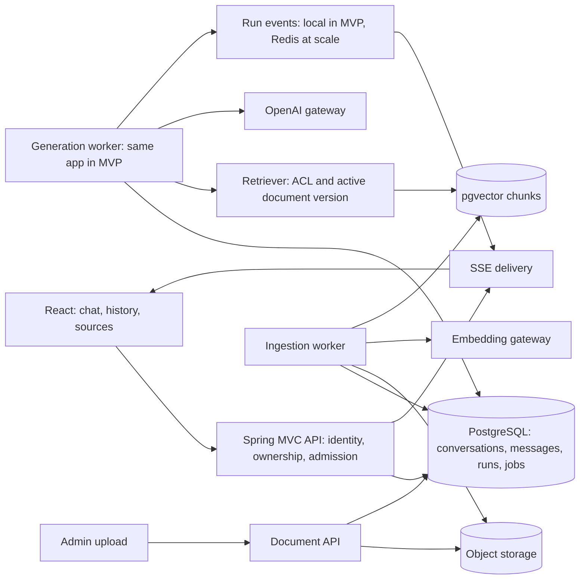

# AI-чат с RAG: архитектура и путь к 1–5 тыс. RPS

Дата: 23 сентября 2026. Статус: предложение для реализации, не отчёт о достигнутой производительности.

Подтверждено владельцем: **1–5 тыс. RPS относятся ко всем запросам API; первая версия — чат с поиском по своим документам (RAG)**. Задачи с зависимостями и критериями приёмки: [ai-chat-backlog.md](ai-chat-backlog.md).

## 1. Решение

Начать с **модульного монолита Spring Boot + PostgreSQL/pgvector**, асинхронного выполнения генераций и SSE для доставки ответа в React. Обработку документов выполнять фоновым worker. Сохранить возможность отдельно запускать API, generation worker и ingestion worker из того же кода, когда измерения покажут необходимость.

Первый chat agent — контролируемый pipeline: **проверить доступ → собрать историю → найти документы → сформировать контекст → один streaming-вызов OpenAI → сохранить ответ и источники**. Неограниченный цикл рассуждений/tools для этого сценария не требуется. Дополнительные LLM-вызовы для query rewrite, reranking или summary добавлять после оценки качества и нагрузки.

Для MVP достаточно одной реплики backend, PostgreSQL и хранилища файлов. Перед несколькими репликами нужны общие квоты, владение заданиями и межрепличная доставка событий; Redis предлагается для лимитов и короткого журнала SSE. Kafka, Kubernetes, отдельную векторную БД и микросервис на каждый модуль пока не вводить.

## 2. Что реально есть в проекте

- Backend: Java 21, Spring Boot **3.5.3**, Spring AI **1.0.0**, MVC/JPA — `backend/build.gradle`. Единственный endpoint приложения — `/api/ping` в `backend/src/main/java/com/hackalem/web/PingController.java`.
- `backend/src/main/resources/db/migration/V1__init.sql` только включает `vector`. Таблиц чата и документов нет. Spring AI OpenAI starter есть, pgvector VectorStore starter и ingestion ещё не подключены.
- `SecurityConfig.java` содержит `.anyRequest().permitAll()`. JWT-зависимости и bearer-схема OpenAPI не означают работающую авторизацию.
- Уже правильно настроены Flyway, `ddl-auto: validate`, `open-in-view: false`, env-конфигурация и healthchecks.
- Frontend: React, TanStack Query и generated SDK; пока один экран с ping. `frontend/src/client/**` генерируется, вручную его не править.
- В generated client уже есть fetch-based SSE helper, хотя REST использует axios. Axios interceptor из `src/lib/api.ts` не переносит JWT в SSE. Helper поддерживает event ID и AbortSignal, но его default retry не является готовой продуктовой политикой восстановления.
- Compose — локальное окружение. Фиксированные `container_name` и host ports не подходят для простого масштабирования реплик или независимых параллельных окружений.
- На момент исследования PostgreSQL healthy; frontend на `localhost:5173` не отвечал. В просмотренных файлах нет URL или конфигурации подтверждённого Railway/Render deployment. Живой deployment не проверен.

Проверка исходного каркаса: `./gradlew build`, `npm run build`, `npm run lint` завершились успешно. В backend тестовых исходников пока нет (`test NO-SOURCE`); эти проверки не подтверждают работу будущего чата, RAG или заявленную нагрузку.

README указывает сценарий ассистента ekt.kz. Предположение для плана: документы публикует администратор workspace, посетители имеют отдельные разговоры. Для приватных загрузок хранить дополнительный owner/ACL. Источник identity сайта, реальный объём документов, языки и доля генераций пока не заданы; это входы задачи CHAT-01.

## 3. Что означает требование RPS

Разделить четыре величины: HTTP requests/s, новые AI turns/s, активные SSE-соединения, токены/s. SSE-chunks внутри открытого ответа не являются новыми HTTP-запросами. Подписки, reconnect, history и status входят в общий HTTP RPS. Трафик загрузки файлов дополнительно измеряется в bytes/s.

Пусть `R` — суммарный RPS, `f` — доля запросов, создающих AI turn, `a` — среднее число generation-вызовов OpenAI на turn, `T` — средняя длительность turn после запуска.

```text
turns/s = R × f
generation calls/min = R × f × a × 60
active turns ≈ R × f × T              (закон Литтла, стабильная нагрузка)
generation token volume/min = R × f × a × 60 × (I + O)
```

`I/O` — средние input/output tokens на generation-вызов. Последняя формула оценивает объём токенов, **не воспроизводит точный алгоритм OpenAI rate limiting**: необходимо учитывать правила модели, output reservation и response headers. Embeddings, moderation, retries и ingestion считаются отдельно. Для многошагового агента concurrency provider calls зависит также от длительности каждого шага.

Расчётные примеры при `f=10%`, `a=1`, `T=15 с`, `I=3 000`, `O=500`:

- **1 000 API RPS:** 100 turns/s; 6 000 generation calls/min; около 1 500 активных turns; 21 млн generation tokens/min.
- **3 000 API RPS:** 300 turns/s; 18 000 calls/min; около 4 500 turns; 63 млн tokens/min.
- **5 000 API RPS:** 500 turns/s; 30 000 calls/min; около 7 500 turns; 105 млн tokens/min.

При 5 000 API RPS, но `f=1%`: 50 turns/s, 3 000 calls/min, около 750 активных turns. При `f=20%`: 1 000 turns/s и около 15 000 активных turns. Активные SSE примерно равны активным turns только при одной подключённой вкладке на turn; отдельно учитывать очередь, несколько вкладок, reconnect и отключённых пользователей. Для sizing брать **измеренную среднюю** длительность и запас; p95 измерять как отдельный SLO, не подменять им среднее в формуле.

**Следствие:** производительность нашего API и доступная ёмкость OpenAI — два независимых условия. У OpenAI лимиты зависят от модели, организации/проекта и RPM/TPM; действительные квоты нужно прочитать в аккаунте. Несколько API keys не создают новую квоту одной организации. [OpenAI rate limits](https://developers.openai.com/api/docs/guides/rate-limits).

Для оценки расходов без выдуманных тарифов: `USD/hour = turns/s × 3600 × a × (I × price_input + O × price_output) / 1 000 000`, если цены заданы за миллион токенов. Отдельно прибавить embeddings, ingestion, cached/reasoning tokens по тарифу модели, storage и инфраструктуру. Уточнить peak/sustained RPS и суточный duty cycle до расчёта бюджета.

## 4. Границы модулей и два контура



Имена обозначают логические модули, не обязательные отдельные сервисы. Размещение в существующих пакетах:

- `web/chat`, `web/documents`: DTO, validation, OpenAPI, ProblemDetail, SSE envelope.
- `domain/chat`: Conversation, Message, ChatRun, ownership, idempotency, lifecycle.
- `domain/documents`: Document, DocumentVersion, IngestionJob, ACL, publication/deletion.
- `ai/chat`: ChatOrchestrator, ContextBuilder, LlmGateway, prompt versions, usage.
- `ai/rag`: DocumentRetriever, Chunker, EmbeddingGateway, CitationAssembler.
- `config`, `security`: executors, timeouts, clients, admission, trusted principal.

**Runtime:** оставить MVC/JPA для первого релиза. Async MVC освобождает request thread во время ожидания, но запись streaming-ответа остаётся blocking и использует executor. Настроить bounded executors, transport timeouts и буферы; JPA не вызывать на event-loop. Сам `Flux` или virtual threads не гарантируют требуемую ёмкость. [Spring MVC 6.2 async](https://docs.spring.io/spring-framework/reference/6.2/web/webmvc/mvc-ann-async.html).

Spring AI `ChatClient` поддерживает streaming; для него нужен reactive HTTP stack. Проверить фактический dependency graph и совместимость **закреплённой версии 1.0.0**, не копировать API из последней документации без spike. Добавление WebClient не означает миграцию всего сервера на WebFlux. [Spring AI 1.0 ChatClient](https://docs.spring.io/spring-ai/reference/1.0/api/chatclient.html).

**OpenAI API:** для нового provider adapter предпочтителен Responses API; OpenAI рекомендует его для новых проектов, при этом Chat Completions остаётся поддерживаемым. Для быстрого demo допустим имеющийся Spring AI ChatClient с Chat Completions, если compatibility spike подтверждает stream/usage/cancel. Скрыть выбор за `LlmGateway`; не поддерживать два production-пути одновременно без причины. [OpenAI migration guide](https://developers.openai.com/api/docs/guides/migrate-to-responses).

Модель в конфигурации сейчас `gpt-4o-mini`; это исходный baseline, не результат выбора лучшей модели. Выбор и фиксацию модели делать на собственных вопросах по latency, качеству, доступной квоте и цене. Источником истории остаётся наша БД; не смешивать неявно память Spring AI, полный replay истории и provider-side conversation state. Если используется Responses, явно выбрать storage policy; `store:false` не является обещанием полного отсутствия retention у провайдера.

## 5. Протокол чата и жизненный цикл

Предлагаемый API v1:

```text
POST   /api/conversations
GET    /api/conversations?cursor=...&limit=...
GET    /api/conversations/{id}/messages?cursor=...&limit=...
POST   /api/conversations/{id}/messages     Idempotency-Key → 202 {messageId, runId}
GET    /api/runs/{id}                       status + persisted result/partial snapshot
GET    /api/runs/{id}/events                text/event-stream; Last-Event-ID
POST   /api/runs/{id}/cancel
POST   /api/documents                       bounded multipart upload → 202 {documentId}
GET    /api/documents?cursor=...&limit=...
GET    /api/documents/{id}                  ingestion state
GET    /api/documents/{id}/versions/{versionId}/source  authorized immutable source
DELETE /api/documents/{id}                  revoke search access, then cleanup
```

Это проект контракта. Backend публикует схемы через springdoc; затем `npm run gen`. SSE-события описать как DTO union с discriminator и типами payload в OpenAPI. Источники имеют version/page/section/chunk ID. Идентификаторы источников валидирует backend; URL от модели не превращать автоматически в ссылку на документ.

Поток отправки:

1. Проверить identity, ownership и размер сообщения; найти существующий idempotency result и проверить hash payload. При повторе вернуть тот же результат без нового quota reservation, даже если сейчас квота исчерпана или уже есть другой active run. Для новой операции проверить разрешённые documents, квоты и лимит очереди.
2. В короткой транзакции создать user message и queued run. `(principal, conversation, idempotency_key)` уникален; хранить hash payload. Тот же ключ и payload возвращают тот же результат, другой payload — `409`. Конкурирующий active run в conversation — `409`, а не две несогласованные истории. DB unique constraint разрешает гонку одновременных retry; проигравший освобождает только собственное quota reservation.
3. Ответить `202` только после durable commit. Worker забирает run с lease/claim. В MVP job table в PostgreSQL и bounded executor; scheduler повторно подхватывает не запущенные queued jobs после рестарта.
4. Worker читает ограниченную историю и RAG-контекст, вызывает OpenAI **вне DB-транзакции**. Не держать connection из DB pool на время generation.
5. Публикует `run.started`, `retrieval.completed` с разрешёнными sources, `message.delta`, затем `run.completed|run.failed|run.cancelled`. Envelope: `eventId`, `runId`, `seq`, `type`, `schemaVersion`, payload. Не возвращать в UI скрытые рассуждения модели.
6. Финальный ответ, usage и citations сохраняются до публикации terminal event. Закрытие HTTP без terminal event не означает успех.

Run states: `queued → retrieving → generating → completed|failed|cancelled`. Deadline и failure reason хранятся отдельно; cancel допустим из любого незавершённого состояния. Terminal transition — compare-and-set; гонка completion/cancel имеет один результат. Lease с fencing version защищает БД и публикацию SSE от опоздавшего worker: событие несёт attempt/epoch, publisher и subscriber отклоняют stale epoch и deltas после terminal event. Не полагаться только на прекращение старого потока по сети.

**Надёжность:** at-least-once выполнение задания не означает exactly-once вызов OpenAI или списание. После неизвестного исхода provider request нельзя автоматически перезапускать весь turn: отметить `failed` с причиной `outcome_unknown`, сохранить partial и предложить явный повтор новым run. Восстановление queued job до provider call допустимо; возобновление уже начатой генерации требует отдельного подтверждённого механизма провайдера.

**Reconnect:** `GET events` только подписывается и никогда не создаёт новую генерацию. В одной реплике MVP допустим ограниченный локальный replay buffer; после его потери/истечения возвращать документированную ошибку `replay_unavailable` и читать persisted status/snapshot. Пропущенные deltas не выдавать за восстановленные. Для нескольких реплик — общий короткий журнал событий в Redis Streams с TTL/size bound и подписка через любую реплику. Финальный результат остаётся в PostgreSQL; Redis не единственное хранилище ответа.

Сохранение partial — агрегировано по времени/размеру, не SQL UPDATE на каждый токен. При slow client ограничить output buffer, отключить подписку и предложить reconnect/status; worker не накапливает неограниченный backlog. Disconnect подписчика не отменяет run автоматически; кнопка Stop отправляет cancel API. Это позволяет обновить страницу без потери активного run. Deadlines ограничивают стоимость генераций без подписчика.

Для обычного текстового чата подходит SSE; OpenAI также поддерживает incremental HTTP streaming. У собственного API свои события, не публичный pass-through vendor schema. [OpenAI streaming](https://developers.openai.com/api/docs/guides/streaming-responses).

## 6. Данные и RAG

Минимальная модель:

- `conversation`: id, workspace_id, owner_id, title, next_seq, timestamps.
- `message`: id, conversation_id, seq, role, content, status, run_id, timestamps. Unique `(conversation_id, seq)`; cursor `(seq,id)`, ограниченный page size.
- `chat_run`: owner/workspace, user_message_id, assistant_message_id, idempotency key/hash, state, lease/version, deadlines, prompt/model version, provider request ID, usage, error code. Partial unique index на conversation для active states.
- `document`: workspace/owner, visibility, active_version_id, desired_version_id, deletion timestamp. Publish выполняет CAS по desired_version_id и действующей lease, чтобы старый reindex не заменил более новый.
- `document_version`: immutable source object key/checksum, source version, ingestion status, parser/chunker/embedding versions, content hash, error; публикация только готовой версии. Старые citations открывают оригинал своей версии, даже после публикации новой.
- `document_chunk`: document_version_id, chunk index, content, embedding, workspace/ACL metadata, page/section; unique `(document_version_id, chunk_index)`.
- `message_citation`: message, document version, chunk, snippet/location. Идентификаторы позволяют проверить источник и не путают версии.
- `ingestion_job`: state, attempt, lease/deadline, dedup key, error. Jobs и lifecycle обновляются атомарно; при внешнем broker позже применить transactional outbox.

Индексы: conversations по `(workspace_id, owner_id, updated_at, id)`, messages по `(conversation_id, seq)`, jobs по состоянию/времени claim, chunks по scope/version. Конкретные SQL и индексы проверять `EXPLAIN ANALYZE` на ожидаемом корпусе. Не вводить partitioning до измерений роста/запросов.

Выбор для retrieval: собственная таблица `document_chunk` и небольшой `JdbcTemplate`-адаптер с явным SQL ACL/version predicate; JPA для chat/documents, Spring AI для embeddings/generation. Готовый PgVectorStore можно использовать в отдельном spike, но его metadata-схему не смешивать незаметно с собственной моделью. Автоматическое создание vector schema отключить, миграциями управляет Flyway. [Spring AI 1.0 PGvector](https://docs.spring.io/spring-ai/reference/1.0/api/vectordbs/pgvector.html).

Ingestion:

```text
upload → uploaded → extracting → chunking → embedding → ready
                               ↘ failed (reason, bounded retry)
delete → immediately excluded from retrieval → asynchronous physical cleanup
```

1. Для первого demo поддержать UTF-8 TXT/Markdown; PDF с текстовым слоем — следующая задача. OCR/сканы не обещать без отдельного scope. Проверять content type, размер файла, extracted text/page limits; парсер изолировать timeout/лимитами ресурсов.
2. Оригинал — object storage; для локального demo допустим отдельный persistent volume. Общий provider quota budget для запросов пользователя и ingestion с приоритетом интерактивных запросов.
3. Сохранить структуру заголовков и страницы. Стартовая **гипотеза** chunking: 400–800 токенов, overlap 50–100, top-k 5–8; затем подобрать по golden set. Это не универсальные оптимальные значения.
4. Выбрать embedding model, dimensions и metric один раз для индекса. Практический baseline — `text-embedding-3-small`, 1536 измерений; проверить доступ/квоты. HNSW для типа `vector` в pgvector поддерживает до 2000 измерений: default 3072 у другой модели нельзя незаметно подставить в такой индекс. [OpenAI embeddings](https://developers.openai.com/api/docs/guides/embeddings), [pgvector](https://github.com/pgvector/pgvector).
5. Embedding batches ограничить и сделать idempotent по версии/chunk hash. Перезапуск не дублирует chunks; dedup учитывать внутри разрешённого scope, не раскрывать наличие чужих файлов.
6. Готовую новую версию публиковать атомарно после всех chunks, проверяя tombstone, lease и ожидаемую source version: поздний worker не восстанавливает удалённый документ и не откатывает более новую версию. Пока переиндексация идёт, поиск использует прежнюю ready-версию. Смена модели embeddings — новый индекс/версия и переключение после backfill, не смешивание векторов.

Retrieval всегда применяет **серверный ACL и active/ready version filter** до помещения текста в prompt. Пользовательские document IDs — лишь дополнительное сужение разрешённого набора. Проверки нужны для поиска, citations/source endpoint, удаления и cache keys. UUID не заменяет authorization. При отзыве доступа блокировать выдачу источника сразу; уже показанный ответ невозможно «забрать назад» — политика удаления истории задаётся отдельно.

Для небольшого корпуса начать с exact search как baseline качества. HNSW включать по измеренной latency/объёму. При approximate search фильтрация может уменьшать число найденных результатов; проверить recall внутри tenant и поведение restrictive ACL, настройку iterative scans — только на подтверждённой версии pgvector. Индекс на filter columns и стратегия партиций по корпусам выбираются по данным. [pgvector filtering](https://github.com/pgvector/pgvector#filtering).

ContextBuilder делит токен-бюджет между system instructions, историей, вопросом и найденными chunks; сохраняет место для ответа. Полная история хранится для UI, но не пересылается целиком в LLM каждый раз. Для длинных диалогов — bounded recent window, затем versioned summary по отдельной задаче. Простую эвристику «N символов = токены» не использовать как единственную защиту от context overflow.

Документ — недоверенные данные: инструкции из него не меняют system policy и не дают дополнительных прав. Model prompt требует опираться на фрагменты и ссылаться на выданные source IDs. Backend проверяет существование/доступность ID; наличие корректной ссылки само по себе не доказывает истинность утверждения. При отсутствии оснований отвечать «В доступных документах нет достаточной информации»; пороги релевантности калибровать на данных. При конфликте источников назвать конфликт/версии.

## 7. Производительность и устойчивость

**Admission control:** лимиты по principal/workspace плюс общий provider budget по RPM, оценке TPM и active calls; отдельные лимиты на upload/embedding/SSE. Резервировать ожидаемый максимум перед вызовом, затем сверять usage. До multi-replica запусков перенести счётчики в общее хранилище. Fail-closed для новых платных turns при недоступных глобальных лимитах; историю обслуживать независимо, пока доступна БД.

Очередь ограничивается длиной **и временем ожидания**. Условие стабильности: accepted turns/s меньше устойчивой completion capacity. Например, если пришло 500 turns/s, а доступны 300, backlog растёт на 200 jobs/s — очередь не решает недостаток квоты. При превышении квоты пользователя вернуть `429`; при системной недоступности/исчерпании admission capacity — `503`, с документированным Retry-After где применимо, до durable принятия.

Retries: учитывать status/error code и Retry-After, применять backoff+jitter в пределах общего deadline; один слой владеет retry policy. Не повторять billing/auth failures и уже выданный stream автоматически. [OpenAI rate limits](https://developers.openai.com/api/docs/guides/rate-limits).

История: cursor pagination, индексы, компактные DTO, query budget, разумные cache headers для приватных данных. Не делать status polling во всех вкладках: **10 000 вкладок × 1 запрос/2 с = 5 000 RPS** только на статусы. UI обновляет stream пакетами и invalidates историю после terminal event.

На высокой concurrency bottlenecks включают LB connection/idle limits, file descriptors, socket buffers, HTTP client pools, CPU/GC, DB pool и Redis event bytes/s. Hikari pool sizing — по коротким DB-операциям; сумма pool sizes всех реплик должна помещаться в DB connection budget. LLM connection не равен DB connection.

Сохранять локальный Compose для demo. До горизонтального scaling проверить общий storage, distributed admission, leases, SSE routing/replay и drain при deploy. Текущий frontend nginx обслуживает только статику: отключение buffering требуется **на реальном API proxy/LB**, если он будет добавлен. Проверить heartbeat, idle timeout, graceful shutdown на выбранном хостинге. Возможность Railway/Render выдерживать конкретный профиль требует проверки тарифов/лимитов и benchmark.

## 8. Проверка качества и нагрузки

Предлагаемые цели для согласования, **не текущие измерения**:

- History/status: p95 ≤ 200 мс, p99 ≤ 500 мс при оговорённых page sizes и профиле 1k/3k/5k.
- POST message acceptance: p95 ≤ 300 мс до `202`, без ожидания OpenAI.
- Queue wait: p95 ≤ 1 с в пределах согласованной capacity; перегруз не скрывается успешными `202`.
- Time to first text delta от submit: p95 ≤ 3 с для выбранного корпуса, модели и token budget; включает queue/retrieval/provider. Может потребовать изменения модели/квоты, не гарантируется одним streaming.
- Unexpected 5xx < 0.1%; admission rejection rate измеряется отдельно и для профиля заявленной capacity также ≤ 0.1%. Для admitted runs целевой completion success ≥ 99% при здоровом provider; сбои и отмены классифицируются отдельно.
- Golden set: ≥ 50 вопросов с ожидаемыми источниками, включая follow-up, отсутствие ответа, конфликт, RU/KZ при необходимости. Начальные release gates: retrieval Recall@5 ≥ 90% на answerable subset, корректное основание/citation ≥ 90% по ручной rubric, 0 утечек в подготовленных cross-owner тестах. Последнее не является доказательством отсутствия всех возможных утечек.

План испытаний:

1. Измерить baseline build/demo; подготовить corpus scale, payload lengths, user distribution и endpoint mix. Зафиксировать долю POST turns и GET SSE, чтобы RPS не считался дважды или не исключал неудобные endpoint.
2. Нагрузить реальные auth/DB/retrieval маршруты с **mock LLM и mock embeddings**. Mock должен удерживать connection и выдавать chunks с реалистичными TTFT/duration/token distribution; мгновенный ответ не проверяет streaming capacity.
3. Использовать open arrival-rate workload в k6/Gatling; подобрать generator с проверенным SSE support. Если основной инструмент не читает SSE, выделить stream driver и измерять его arrivals/connections/errors вместе с REST, не считать один лишь POST benchmark end-to-end.
4. Ступени 1k → 3k → 5k HTTP RPS, каждый уровень после прогрева минимум 15 минут; затем 60 минут steady soak. Распределённые load generators и connection capacity самих генераторов проверить отдельно. Измерять offered/admitted/completed rates, dropped iterations, queue age и память.
5. Воспроизвести duplicate send, чужой ID, client disconnect, slow reader, expired token, worker restart, Redis outage, OpenAI 429/timeout/5xx, ingestion failure. История сохраняет SLO, очереди/буферы не растут бесконечно, неизвестный provider outcome не вызывает скрытых дублей.
6. Реальный OpenAI end-to-end тест — отдельный ограниченный прогон в согласованных квотах/бюджете с постепенным ростом. Mock 5k RPS доказывает только собственный контур; заявлять полную capacity можно после проверки provider capacity и реального mix.

Метрики: HTTP p50/p95/p99 по route template, accepted/rejected turns, active SSE/runs, queue age, retrieval latency/recall, TTFT, completion latency, tokens и оценка стоимости, OpenAI error codes, DB pool waits, Redis memory/lag, ingestion throughput. Trace ID связывает request/run/retrieval/provider request; prompts и документы по умолчанию в логи не писать. Не использовать conversation/user IDs как metric labels.

## 9. Этапы

**Demo на оставшиеся 5 часов:** один источник identity, один формат TXT/Markdown, один RAG pipeline и одна backend replica. Контракт/таблицы → ограниченная ingestion → stream с историей/источниками → smoke/деплой. Это ограниченный demo-scope, без заявления о 5k RPS. Если время сокращается, документы индексировать заранее через тот же ingestion путь; UI upload вынести после demo.

**MVP:** восстановление run/status, idempotency, cancel, ACL, доступные citations, versioned docs, bounded retries, метрики, integration/browser tests.

**Проверка 1k–5k:** утверждённый нагрузочный контракт и квоты, общий limiter/event journal, replicas/workers, realistic benchmark и испытание отказов. Количество реплик определять по измеренной ёмкости при соблюдении SLO и запасу, а не делить RPS на произвольную цифру.

Следующие расширения — PDF/OCR, hybrid search/reranker, summary/query rewrite, tool actions — только после базового измеримого чата. Для tool actions понадобятся allowlist, отдельная authorization, schema validation, idempotency и подтверждение необратимых операций; это не часть текущего MVP RAG.
