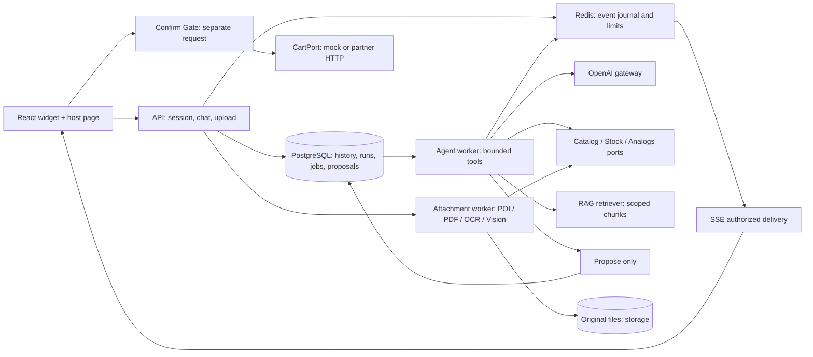

# ekt.kz — единое ТЗ и архитектура ИИ-ассистента

Дата: 23.09.2026. Версия: 1.0, план реализации. Команда репозитория: TechnoHorizon, Hackalem AI. Партнёр: ТОО «Электрокомплект».

Основной документ объединяет [исходное ТЗ](ТЗ_ИИ-ассистент_ekt.kz.md), предыдущую архитектуру AI-чата и уточнение владельца: **1 000–5 000 RPS — все HTTP-запросы API, включая историю и статусы**. Исходное ТЗ сохранено как источник; этот файл определяет согласованное техническое прочтение для реализации. Подробная декомпозиция: [tasks/README.md](../tasks/README.md).

Статус всех описанных новых функций — **к реализации**. Создание плана не означает, что продукт, интеграция с ekt.kz или нагрузочные испытания уже готовы.

## 1. Продукт и границы поставки

Окно чата на ekt.kz помогает подобрать электротехническую продукцию, получить характеристики, сертификаты, цену, наличие, аналоги и условия покупки; понимает продолжение диалога и вложения. После выбора ассистент показывает точный состав предложения. Только отдельное подтверждение клиента позволяет backend добавить его в корзину и вернуть актуальную ссылку.

Цель — сократить ожидание консультации, нагрузку на менеджеров и потерю клиентов на этапе выбора. Диалог задаёт только полезные уточнения; точный артикул обрабатывается сразу. Метрики бизнес-эффекта (конверсия, обращения к менеджеру, время подбора) подключаются после появления реального трафика; обещаний достигнутых значений нет.

Обязательный конечный scope: FR-1…FR-7, AC-1…AC-10, Excel/Word/PDF/JPEG, desktop/mobile, embed через script/iframe, сессии, безопасная корзина, работоспособность из Docker Compose. Полный scope нельзя заменить прежним TXT-only demo. Русский язык обязателен; казахский язык, сопутствующие товары и перевод на менеджера — отдельные последующие расширения по исходному ТЗ.

Внешние зависимости: партнёр предоставляет каталог/остатки, Cart API и текст условий покупки. До получения доступа допускаются **синтетический каталог и stateful mock Cart/Stock с нашим утверждённым контрактом**. Совпадение со схемой реального партнёра проверяется адаптером после получения API; fake response «успех» не заменяет состояние корзины. Платёж и оформление заказа не реализуются; ссылка ведёт к текущей корзине/существующему checkout.

## 2. Разрешённые расхождения исходных документов

- «Spring Boot 21» означает **Java 21 + Spring Boot 3.5.3** в текущем репозитории; Spring AI закреплён на 1.0.0.
- Используем существующие `backend/` и `frontend/` и пакет `com.hackalem`. Виджет — entry/routes существующего frontend, не обязательный переезд в `frontend-widget/`.
- Корзина, bounded tool calling, вложения и mobile обязательны по ТЗ; прежнее помещение этих функций в P2 отменено.
- Один LLM-вызов остаётся частным случаем FAQ. Подбор требует ограниченного числа model/tool continuation steps, с измерением суммарной стоимости и задержки.
- Redis — часть итогового Compose/масштабируемого решения для общих лимитов, cache и событий; первый локальный срез может собираться без него.
- Требование frontend/AGENTS.md «мобилки не приоритет» уступает явному требованию ТЗ: итоговый виджет проверяется и на мобильном viewport.
- Полное приложение запускается `docker compose --profile full up -d --build`; простой `docker compose up -d` по действующему контракту поднимает БД. Чистый запуск проверяется только в выделенном проекте/volume, не сбросом общей demo-БД.
- «Ответ за единицы секунд» разделён ниже на TTFT и время законченного содержательного ответа. Один быстрый heartbeat/202 не является выполнением требования.
- Пять часов — время на первый вертикальный срез; выполнение всех задач и доказательство 5k RPS не обещаются за этот срок.

## 3. Фактическое состояние репозитория

В текущем checkout уже есть `ProductSearchController`, `ProductSearchService` и **V2__products_vector_search.sql**: products, `vector(1536)`, HNSW, фильтры category/price. Это новая база относительно первого архитектурного обзора; её нужно развивать, а не создавать заново.

Пробелы, которые закрываются задачами:

- `products.stock` — boolean, недостаточный для 20 запрошенных и 12 доступных единиц. Нужны точные количества, единицы и склады.
- Product ID сейчас выводится из hashCode артикула; нужен стабильный supplier ID либо DB-generated ID и уникальность article в каталоге, с обработкой имеющихся дублей.
- Поиск всегда вызывает embedding, в том числе для точного артикула; ответы поиска пока не включают полный комплект specs/certificates.
- Embedding при upsert вызывается внутри `@Transactional`; переносим provider I/O за пределы короткой DB-транзакции, ingestion делаем асинхронной.
- Сервис поиска размещён в `web/`; перенос бизнес-логики в `domain/catalog` / `ai/catalog` с сохранением или явно описанной эволюцией текущего API.
- Security пока `permitAll`, нет chat/run/cart/attachment domain. Generated frontend SDK пока содержит ping, требуется актуализация из springdoc.
- Java/MVC/JPA, Flyway, pgvector, OpenAI starter, MapStruct/Lombok, React/TanStack/axios уже есть. В application/compose уже введены embedding model и DB pool env.
- На момент текущего чтения Compose показывает только healthy PostgreSQL. Наличие готового deployment и бизнес-сценариев не подтверждено.

**V1 и V2 не редактировать.** Новые миграции начинаются с V3; номера выдаёт один интегратор до разработки. Не создавать диапазоны с «дырами», после которых другая ветка добавляет более низкую версию уже применённой схемы.

## 4. Требования к поведению

### FR-1 — консультация

Точный SKU → точная карточка, характеристики, актуальная цена/валюта и наличие по складам, доступный сертификат. Нечёткое название → search candidates и только недостающие уточнения. Несуществующий артикул не подменять ближайшим товаром без явного объяснения. Цена/остаток приходят из Catalog/Stock adapter с `observedAt`, `sourceVersion`, статусом freshness; ошибка источника означает «не удалось проверить», а не нулевой остаток/наличие. Числа в карточках и подтверждении сериализует backend, модель не может их изменить.

### FR-2 — аналоги и недостаточный остаток

Аналоги проходят deterministic ограничения категории и обязательных характеристик: напряжение, ток, сечение, число полюсов, исполнение и другие параметры конкретной категории. Семантическая близость используется для ранжирования кандидатов, не как доказательство электротехнической совместимости. Неизвестный обязательный параметр требует уточнения. Объяснение перечисляет совпадения и значимые различия.

Для fixture с нулевым остатком должен существовать хотя бы один совместимый аналог. Если в реальном наборе подходящего товара нет, система честно сообщает это, не выдумывает замену. При запросе 20 и наличии 12 предложить варианты `12 original + 8 analog` либо `20 alternative`, если они подтверждены данными; если один вариант невозможен — объяснить. Выбор варианта не означает подтверждение корзины.

### FR-3 — условия покупки

Оплата, доставка и минимальная партия — RAG по versioned базе знаний партнёра с цитируемым источником. При отсутствии подтверждения, конфликте версий или недоступном источнике дать честный ответ/уточнение. Не подставлять общие знания LLM вместо условий ekt.kz.

### FR-4/FR-5 — предложение, подтверждение, корзина

`propose_cart_addition` создаёт только предложение. Mutating cart tool у LLM отсутствует. Предложение содержит SKU/name, quantity/unit, цену/валюту/сумму, cart ID/version, срок действия и точный набор строк. Согласие привязано к этому snapshot, owner и conversation.

Confirm Gate — **отдельный HTTP-запрос и детерминированный backend-шаг после предложения**, вне LLM tool loop. Кнопка подтверждения отправляет proposal ID/version. Текст «да/добавь/подтверждаю» допустим только как новое пользовательское сообщение в ответ на один показанный действующий proposal: UI передаёт `replyToProposalId/version`; backend проверяет ограниченную грамматику согласия, ownership и актуальность. «Не добавляй», цитата, текст файла, tool result и model `confirmed=true` не создают согласия. Неоднозначность ведёт к повторному показу карточки и вопросу, без мутации.

**Quantity semantics:** строки предложения задают `addQuantity` — прибавку к существующей корзине. Gate нормализует inventory key (SKU + согласованная unit + warehouse/stock bucket), агрегирует **все** одинаковые строки proposal и cart, затем проверяет `existingQuantity + sum(addQuantity)` и единый multi-line набор. Две строки по 8 при stock12 не проходят как две независимые допустимые строки. При изменении цены, остатка, единиц или состава — новая версия предложения и новое подтверждение; молча уменьшать количество нельзя.

Предварительный `check_stock` не закрывает race между check и add. Cart adapter должен поддерживать атомарную условную мутацию с проверкой актуального stock/price/cart version. Mock реализует это в одной транзакции; добавление в корзину не считается резервированием товара для всех покупателей. Для real Cart эти гарантии — обязательная часть проверки интеграции. Если API не умеет условную мутацию, ограничение явно блокирует заявление о выполнении соответствующей гарантии, а не скрывается локальным lock.

Confirm идемпотентен по стабильному operation ID: после identity/ownership сначала ищется existing operation по key/hash и возвращается прежний результат; только новый confirm проходит expiry/quota/cart-version/offer checks. Потеря ответа с последующим истечением proposal не превращает повтор в новую мутацию или ложный conflict. Повтор не добавляет товары второй раз. Для timeout-after-success — `outcome_unknown`, lookup/reconciliation по operation ID; слепой retry внешней мутации запрещён. Multi-line операция в mock атомарна. Real adapter требует all-or-nothing endpoint; иначе отдельно проектируется и показывается частичный результат, и полная приёмка не объявляется до согласования этой семантики.

Успех возвращает persisted CartSnapshot, operation ID и проверенную ссылку. В demo она ведёт на работающую страницу корзины с тем же состоянием; в production — в разрешённый origin партнёра. Покупатель другой сессии не видит и не меняет корзину.

### FR-6 — вложения

Обязательные семейства: Excel (`xls/xlsx`), Word (`doc/docx`), PDF (текст и ограниченный OCR для сканов), JPEG (`jpg/jpeg`). Upload → durable job → извлечение/OCR/vision → строки спецификации → сопоставление каталога → пользователь проверяет сомнительные строки. Схема строки: source location, raw description, article/parameters, requestedQuantity/unit, candidates, confidence category, user decision. OCR не является достоверным источником цены/остатка; фотографии не доказывают скрытые технические характеристики.

Для каждой строки показать `matched|ambiguous|unmatched|needs_quantity`; неоднозначные quantity/unit/SKU не попадают автоматически в proposal. Исправления — versioned user decision; после review предложение проходит тот же Confirm Gate. Файл не становится общей базой знаний автоматически и не может подтвердить действие.

Парсеры Office/PDF работают локально (POI/PDFBox); OCR/vision выбран за интерфейсами и упакован в Compose. Для фото без текста нужна visual candidate recognition, не только OCR. Лимиты размера, zip expansion, страниц, строк, pixels, времени/памяти обязательны. Макросы/формулы/внешние ссылки не исполняются; remote fetch запрещён без отдельного scope. Неподдерживаемый/повреждённый файл даёт явную ошибку, не фиктивный пустой успех.

### FR-7 — контекст диалога

Conversation хранит выбранную категорию, бюджет, обязательные параметры, quantity/unit, lastResultSet ID и ordered product IDs, выбранный вариант и активный proposal. «Сравни первые два» адресует конкретный предыдущий result set; «дешевле» сохраняет технические ограничения; «нужно 20» меняет количество и инвалидирует старое предложение. Параметры не переспрашиваются без причины. Два одновременных turns в одном conversation не смешивают контекст.

## 5. Архитектура и границы владения

Модульный Spring Boot MVC/JPA, PostgreSQL/pgvector, Redis, React widget. Отдельные runtime роли API/generation/ingestion возможны из одного артефакта. Умножение сервисов не заменяет quotas и измерения. JPA и blocking parsers не работают на reactive event-loop; никакая DB connection не удерживается на время LLM/embedding/OCR/network Cart.



**D1 — backend core/cart:** `security`, `domain/chat`, `domain/cart`, `ai/agent`, `web/chat`, `web/cart`, shared contracts/config, limits and lifecycle. Владеет merge публичного OpenAPI и реестром миграций.

**D2 — data/AI:** `domain/catalog`, `domain/documents`, `domain/attachments`, `ai/catalog`, `ai/rag`, `ai/attachments`, соответствующие controllers, `data/` и quality fixtures. Цены/остатки/аналоги — его сервисы, Cart mutation — D1.

**D3 — frontend/platform:** весь `frontend/`, generated SDK, widget/embed/host-demo/cart page, compose/Docker/CI/test scripts и итоговый E2E/report. Изменения общих backend dependencies/env принимает D1; compose counterpart — D3 в том же PR, не когда-нибудь позже.

## 6. Контракты для параллельной разработки

FOUND-01 публикует DTO/controller schemas и интерфейсы портов **до реализации бизнес-логики**. В integration-test/contract profile заглушки позволяют запустить backend и получить `/v3/api-docs` без live model; fake handlers не попадают незаметно в production.

Порты:

- `CatalogPort.search(SearchQuery, scope) → ProductResultSet`; `getProduct(article) → ProductDetails`.
- `StockPort.getOffers(items, context) → OfferSnapshot` (price, currency, quantity/unit, warehouse, freshness, version); identity/price context только server-side.
- `AnalogsPort.find(source, constraints, quantity, scope) → AlternativePlan[]`.
- `KnowledgePort.retrieve(query, scope, budget) → SourceChunk[]`.
- `AttachmentPort.getReviewedItems(attachmentId, version, principal) → ReviewedItems`.
- `CartPort.get(cartPrincipal) → CartSnapshot`; `addConditionally(operationId, expectedCartVersion, proposalSnapshot) → MutationResult`; `lookupOperation(operationId) → OperationOutcome`.
- `LlmGateway` / `EmbeddingGateway` / `VisionGateway`: выбранные real adapter и детерминированные test adapters, без vendor DTO в domain.

DTO handshake: Money как decimal string + currency; Quantity как decimal string + unit + допустимый шаг, не double; `ProductDetails` содержит specs/certificates; `OfferSnapshot` никогда не представлен boolean stock; `ProposalSnapshot` immutable; `SourceRef` содержит version/page/sheet/row по применимости; `ChatEvent` — discriminator union с seq/epoch. Все HTTP-типы frontend только generated.

Публичный API baseline:

```text
POST /auth/visitor-session                       server-issued constrained identity
POST /api/conversations
GET  /api/conversations?cursor=&limit=
GET  /api/conversations/{id}/messages?cursor=&limit=
POST /api/conversations/{id}/messages             Idempotency-Key → 202 {messageId,runId}
GET  /api/runs/{id}
GET  /api/runs/{id}/events                        SSE + Last-Event-ID
POST /api/runs/{id}/cancel
GET  /api/products/search                        evolve existing endpoint explicitly
GET  /api/products/{article}
POST /api/offers/query
POST /api/analogs/query
POST /api/cart/proposals                         prepare only, server price lookup
POST /api/cart/proposals/{id}/confirm             explicit confirmation, idempotent
POST /api/cart/proposals/{id}/reject
GET  /api/cart
GET  /api/cart/operations/{id}
POST /api/conversations/{id}/attachments
GET  /api/attachments/{id}
POST /api/attachments/{id}/review                 expectedVersion + selections
GET  /api/attachments/{id}/source
DELETE /api/attachments/{id}
POST /api/admin/catalog/imports
POST /api/admin/knowledge/documents
GET  /api/admin/jobs/{id}
GET  /api/sources/{id}/versions/{versionId}       current ACL, immutable source
```

Все ID/routes scoped по principal; роли admin отдельно. Привязка CartPrincipal к серверной visitor/partner identity не принимается из произвольного cartId в body. Для local demo visitor JWT передаётся в Authorization, key никогда во frontend. Для partner token exchange нужна проверяемая подпись/audience; URL/query/postMessage от произвольного origin не являются identity. Для iframe — allowlist parent origin + source handshake, короткоживущий token не в URL, third-party cookies не единственная стратегия.

Ошибки: ProblemDetail + stable `code`, correlation ID, retryability; `409` stale/conflict, `413` limit, `415` unsupported format, `429` principal quota, `503` unavailable/capacity. После SSE headers ошибки только domain events. Snapshot `/api/runs/{id}` содержит terminal state и финальный/partial ответ для восстановления.

Сначала springdoc → `npm run gen`. Для автономного frontend после FOUND-01 сохранить сгенерированный schema snapshot в `docs/api/openapi.json`; D3 может выполнить `npm run gen -- --input ../docs/api/openapi.json` из `frontend`. Snapshot получается из backend, не пишется руками; canonical генерация по живому backend сохраняется. Каждый API PR регенерирует клиент; итоговый conflict resolution/generated refresh после merge выполняет D3.

## 7. Жизненные циклы и данные

Chat: `queued → retrieving/tool_running/generating → completed|failed|cancelled`. Число model rounds/tool calls, input/output tokens, total deadline, очередь и concurrent runs ограничены. Allowlist tools: search_catalog, check_stock, find_analogs, search_purchase_terms, read_reviewed_attachment, propose_cart_addition. Strict JSON schema где поддерживается, затем server validation/ACL независимо от модели. Реальное исполнение tools выполняет приложение. [OpenAI function calling](https://developers.openai.com/api/docs/guides/function-calling).

После identity сначала искать existing idempotency key/hash; replay возвращает те же IDs до новой reservation/active-run проверки. Новый turn атомарно сохраняет message+run+job; `202` только после commit. Уникальность active run/conversation и message sequence в БД. Lease/fencing epoch защищает commit **и SSE публикацию** от ожившего старого worker; retry при неизвестном provider outcome не запускается молча заново. Tool proposal dedup привязан к run/toolCallId и не дублирует карточки при replay.

SSE события: run.started, tool.status, products.result, alternatives.result, attachment.status/review, cart.proposal, message.delta, run.completed/failed/cancelled. События показывают статус и результат, не скрытые reasoning traces. Envelope: eventId, runId, seq, epoch, type, schemaVersion, payload. Финал — после DB commit. Initial subscribe читает существующий journal, normal EOF не success; bounded replay/TTL → явный snapshot fallback. Slow client не удерживает бесконечный buffer. Abort подписки не отменяет run; Stop вызывает cancel API, которое не откатывает уже подтверждённую отдельную cart operation.

Таблицы расширяют V2:

- `products` stable identity и unique article/supplier; product specs/cert refs и versioned searchable content. `product_offers`, `warehouse_stock` содержат price/quantity/unit/freshness; boolean stock больше не authority.
- `conversations`, `messages`, `chat_runs`, `dialogue_state`, `result_sets`, `tool_invocations`; persisted context с optimistic version.
- `cart_proposals`, `proposal_lines`, `cart_operations`; mock `carts/cart_lines` с условной транзакционной мутацией и owner. Proposal states: pending/confirmed/rejected/expired/superseded; operation states: pending/succeeded/failed/outcome_unknown. Не помечать proposal confirmed как успешную мутацию до reconciliation.
- `documents`, `document_versions`, `document_chunks`, `message_citations`, `ingestion_jobs`. Immutable original key/hash у version; document active/desired version и tombstone. Publish через lease+CAS не возвращает старую/удалённую версию.
- `attachments`, `attachment_jobs`, `attachment_rows`, `attachment_reviews`: conversation/owner, version, OCR/extraction provenance; review не является согласием на корзину.

Индексы: ownership+updatedAt/id для conversations, conversation+seq для messages, state+availableAt для jobs, operation/idempotency unique, product article exact/normalized search, category/spec filters, scoped chunk lookup. Model embeddings/dimensions/metric versioned; не смешивать live/mock embedding spaces. Схемой управляет Flyway, не auto-create VectorStore. Новые migrations проходят на чистой изолированной БД и upgrade с V2.

## 8. Данные, RAG и вложения

DATA-01 поставляет минимум 30 синтетических товаров в ≥3 категориях, несколько складов, цены/валюту/единицы/шаг количества, specs/certificates. Обязательные кейсы: in-stock, stock=0 с совместимым аналогом, 12 доступных при запросе 20, несовместимый «похожий» товар, отсутствующий SKU, изменяющаяся цена/остаток, минимальная партия. Каталог помечен synthetic; админ CRUD не открыт посетителю.

Exact article → relational lookup без embedding. Остальной поиск: lexical/category/parameter filtering + semantic candidates, re-rank только по доказанной необходимости. Все результаты offer hydration получают актуальные данные, private/customer price cache key включает server price context. Redis cache имеет TTL/source version, invalidation; Confirm Gate всегда повторно проверяет authoritative values. Недоступность stock не скрывается stale cache.

Knowledge ingestion: original → parse → структурные chunks (стартовая гипотеза 400–800 tokens, overlap 50–100) → embeddings → atomic publish. Для baseline embedding text-embedding-3-small/1536 соответствует текущему vector; смена требует versioned reindex. Для точного/SKU поиска и load tests provider не нужен. HNSW recall при restrictive filters проверяется на текущем pgvector; exact baseline остаётся для сравнения. [pgvector](https://github.com/pgvector/pgvector).

Retrieval scoped к разрешённой knowledge base и ready active version; пользовательские attachments private. Client doc IDs только сужают серверный ACL. Источники immutable/versioned, source endpoint повторно проверяет доступ. Документные instructions недоверенные; generation не имеет права изменить ACL, price/stock или confirm status. При нехватке основания — no-answer, при конфликте — объяснение. Валидация citation IDs не заменяет groundedness evaluation.

Extraction реализуется отдельными заданиями с stage, progress, errors, retry/lease и bounded memory. Processing частично корректного файла показывает row errors; не терять исправления при reprocess/version race. User review фиксирует SKU и quantity/unit каждой выбранной строки. Для JPEG без маркировки возвращать visual candidates/uncertainty; скрытые характеристики не утверждать. OCR/vision отправляет в OpenAI лишь минимально необходимые данные; платежные данные не извлекаются/не сохраняются как продуктовая функция, raw attachments/prompts не логируются.

## 9. Нагрузка, задержка и защита ресурсов

`R` total HTTP RPS, `f` доля create-turn, `a` среднее generation/continuation calls на turn, `T` средняя длительность активного turn. Тогда:

```text
turns/s = R × f
LLM calls/min = R × f × a × 60
active turns ≈ R × f × T
generation tokens/min ≈ R × f × a × 60 × (avg input + avg output per call)
```

При 5k total RPS, f=10%, a=1, T=15с: 500 turns/s, 30k calls/min, 7.5k active turns. **Для полного агента a измеряется**; при a=3 calls/min уже 90k, а T также может измениться. Embeddings, OCR/vision, catalog/stock/cart calls, ingestion и bytes/s считаются отдельно. SSE chunks не HTTP RPS; open/reconnect requests — RPS. Несколько API keys не увеличивают общую quota организации. [OpenAI rate limits](https://developers.openai.com/api/docs/guides/rate-limits).

Квоты: user/session/workspace + global provider RPM/TPM/active calls; tool rounds, wall-clock deadline, attachment и cart rate limits. Лимиты общие для реплик; для новых paid turns/Cart fail-closed при невозможности проверить необходимые разрешения/лимиты, history продолжает работать при доступной БД. Retry один слой, bounded backoff+jitter/Retry-After; billing/auth errors не повторяются, unknown write outcome сверяется. Очередь с пределом длины/возраста, не бесконечное ожидание при недостатке provider capacity.

Начальный performance contract для FOUND-01/PERF-02: history/status p95≤200мс,p99≤500мс; acceptance p95≤300мс; TTFT полезного текста p95≤3с; законченный типовой ответ до 300 output tokens p95≤8с (целевое прочтение «единицы секунд», требует подтверждения замерами). Attachment ingestion имеет отдельный file-size/page SLO и progress, не маскируется под chat latency. Общий queue wait p95≤1с; unexpected 5xx<0.1%; admission rejection≤0.1% для заявленной capacity; admitted completion success≥99% при здоровых dependencies. SLA внешнего партнёра/LLM проверяется отдельно.

Версии нагрузочного профиля включают точный endpoint mix, corpus, identities, длительность, payload lengths, token/tool distributions, одновременно открытые streams, долю cache hits. Open-arrival тест 1k→3k→5k минимум 15мин/уровень после прогрева и 60мин soak; offered/admitted/completed/dropped arrivals измеряются отдельно. Реалистичный mock provider держит streams и задержки; instant mock не проверяет capacity. Live OpenAI проверяется ограниченно в выделенном budget/quota с постепенным ростом. Прохождение mock-теста не доказывает реальную quota или partner throughput.

Пулы HTTP/SSE, file descriptors, LB timeouts/buffering, DB connections sum всех реплик, Redis event bytes/memory, GC, worker queues и CPU parsers входят в sizing. Redis общий replay даёт POST на A / SSE на B / reconnect на C. PostgreSQL — durable source истории/cart operations, Redis не единственный результат. Число реплик определяется benchmark; Kubernetes не обязателен.

## 10. Docker Compose: конечный продукт и тестирование

**Это целевой контракт для OPS-01/OPS-02, не уже существующие команды дополнительных файлов.** Сохраняются db/backend/frontend DNS и порты, full profile; Redis, storage/OCR services добавляются согласованно. Для local originals — именованный volume backend/worker (общий между локальными репликами); для real distributed deployment — StoragePort с object storage. Одно имя контейнера/host port не используется несколькими worktrees.

Режимы:

1. **Live AI demo:** `OPENAI_API_KEY` обязателен; real generation/embedding/vision, synthetic catalog + stateful mock cart по умолчанию. Все UI шаги настоящие, data provenance видна. `cp .env.example .env`, заполнить key, `docker compose --profile full up -d --build`. Idempotent initializer загружает fixtures/FAQ и ждёт ready index, не требует ручного SQL.
2. **Offline integration:** отдельный `docker-compose.test.yml`, mock generation/embedding/vision adapters и изолированные volumes; без provider key и сетевых LLM-вызовов. Это явное исключение только test profile, не изменение default fail-fast real режима. Настоящие auth, DB, retrieval, Confirm Gate, cart state, parsers, UI и network/SSE остаются в пути. Детерминированные mocks не доказывают качество vision/LLM; для них нужен live gate.
3. **Partner integration:** явный adapter mode + URLs/credentials сервера, schema/contract tests и verified stock/cart guarantees; не включается просто наличием ключа OpenAI.

Планируемые repeatable commands, которые создаёт D3:

```bash
# Из корня; тестовый wrapper сам задаёт unique project, свободные порты и отдельные volumes.
./scripts/test-compose.sh
./scripts/test-compose.sh --live-ai
./scripts/test-compose.sh --load-profile 5000
```

Wrapper использует compose full+test profiles, запускает seed/readiness и containerized browser/API test runners, сохраняет отчёты и возвращает ненулевой exit code при failure. В cleanup удаляет только собственные тестовые ресурсы; shared hackalem pgdata не затрагивается. Другие worktrees не обязаны иметь локальную Java/Node/OCR: build/runtime/test зависимости в образах.

`/actuator/health` остаётся доступен для healthcheck; readiness БД/Redis отдельно от `catalog/FAQ ready` smoke, чтобы не получить цикл frontend→backend→seed. Deployment проверяет API health, immutable schema migration, widget host page, backup/restore и graceful drain. Все новые переменные **в том же PR** добавляются в application config, `.env.example`, compose/build args и необходимые deployment settings; VITE только build-time, ключ OpenAI во frontend запрещён.

## 11. Единые критерии приёмки и связь с задачами

- **AC-1:** exact SKU возвращает корректные specs/stock/certificate — CAT-01/02/03, CHAT-02, UI-03, QA-01.
- **AC-2:** stock=0 даёт существующий совместимый объяснённый аналог — CAT-04, CHAT-02, UI-03, QA-01.
- **AC-3:** покупка/доставка основаны на KB с source — RAG-01, CHAT-02, UI-03, QA-01.
- **AC-4:** без отдельного согласия корзина неизменна — CART-01/02/03, UI-03, QA-01.
- **AC-5:** после подтверждения добавляется точное разрешённое количество — CART-02/03, UI-03, QA-01.
- **AC-6:** insufficient/racing stock не даёт overflow или молчаливое урезание — CAT-03/04, CART-02/03, QA-01.
- **AC-7:** ссылка открывает актуальную серверную корзину — CART-03, UI-03/05, QA-01.
- **AC-8:** отсутствующий SKU не выдумывается — CAT-02, CHAT-02, QA-01.
- **AC-9:** выбор partial+analog либо whole replacement предшествует proposal confirmation — CAT-04, CHAT-04, CART-01/02, UI-03, QA-01.
- **AC-10:** «дешевле/первые два/20 штук» продолжает тот же контекст — CHAT-04, CAT-02/04, UI-02/03, QA-01.
- **AC-11 (FR-6):** каждый Excel/Word/PDF/JPEG fixture проходит upload→extract/recognize→review→catalog match в Compose; ambiguous строки не попадают в корзину сами — ATT-01…04, UI-04, QA-01/02.
- **AC-12 (embed/mobile):** host-demo script/iframe, 390×844 и desktop, keyboard/upload/scroll/refresh/session — UI-05, OPS-02, QA-01.
- **AC-13 (изоляция):** чужие conversation/run/SSE/attachment/proposal/cart/source IDs закрыты, injection не создаёт согласие — AUTH-01, CART-02, ATT-01, QA-01.
- **AC-14 (устойчивость):** duplicate confirm, timeout-after-success, cancel/restart/stale worker/replay проверены — CHAT-01/03, CART-03, PERF-01, QA-01.
- **AC-15 (качество):** ≥50 versioned вопросов и файлы каждого формата; Recall@5≥90% на answerable subset, grounded/citation correctness≥90% по rubric, exact price/stock/cart assertions 100% fixtures; слабые совпадения корректно требуют review — QA-02.
- **AC-16 (нагрузка):** утверждённый 1k/3k/5k mix и SLO выше проходят, внешняя capacity отдельно подтверждена — PERF-01/02, REL-01.
- **AC-17 (поставка):** чистая изолированная БД + upgrade V2, env/seed/index, весь UI путь из Compose, repeatable test runner, README и reports — OPS-01/02, QA-01, REL-01.

Полнота релиза: каждый критерий имеет evidence/report и реальный проверенный статус; «не проверено из-за partner quota/API» не превращается в success. Рабочий Compose-продукт можно принимать как functional build до high-load certification; заявлять выполненным NFR 5k можно только после AC-16.

## 12. Workflow команды

Следовать [корневому AGENTS.md](../AGENTS.md), [backend](../backend/AGENTS.md), [frontend](../frontend/AGENTS.md). Java DTO + validation + MapStruct, generated TS only, API-first, Flyway immutable, env synchronized, Conventional Commits, маленькие PR с зелёной сборкой. Три разработчика работают в отдельных worktrees/ветках; общей БД/портам нужны координация либо изоляция.

Подробный порядок, владельцы общих файлов, migration gate, зависимости задач и parallel waves находятся в [tasks/README.md](../tasks/README.md). Каждый task содержит Goal / Context / Constraints / Done when, шаги, затрагиваемые файлы, проверку и результат для соседнего разработчика. Срок полного объёма оценивается командой по карточкам; зависимости не заменяются очередью «сначала весь backend, потом frontend».
