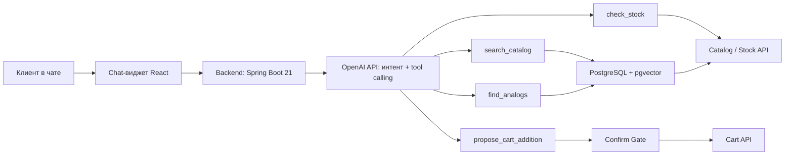

# ТЗ: ИИ-ассистент-консультант для сайта ekt.kz

23 сентября 2026

## 1. Общие сведения

| | |
| --- | --- |
| Название системы | ИИ-ассистент-консультант и помощник для сайта ekt.kz |
| Заказчик / партнёр | ТОО «Электрокомплект» (ekt.kz) |
| Инициатор разработки | Команда хакатона Hackalem AI |
| Тип документа | Техническое задание (ТЗ) на разработку прототипа |
| Статус | Черновик для разработки во время хакатона |

Краткое описание продукта: единое окно чата на сайте ekt.kz, которое консультирует клиента по каталогу электротехнической продукции (характеристики, сертификаты, наличие, аналоги, условия покупки) и, только после явного подтверждения клиента, добавляет выбранные позиции в корзину.

## 2. Цель и задачи

**Проблема.** Сейчас для получения информации о товаре, проверки наличия, подбора аналогов и уточнения условий покупки клиенту ekt.kz нужно писать или звонить менеджеру. Это затягивает решение о покупке, часть клиентов уходит к конкурентам, а менеджеры тратят время на однотипные вопросы вместо сложных сделок.

**Цель.** Сократить время принятия решения о покупке и снизить отток клиентов на этапе консультации за счёт ИИ-ассистента, отвечающего в чате за единицы секунд.

**Задачи**
1. Автоматизировать типовые консультационные вопросы (характеристики, сертификаты, наличие).
2. Предлагать релевантные аналоги при отсутствии позиции на складе.
3. Отвечать на вопросы об условиях покупки.
4. Давать клиенту добавить товар в корзину прямо из диалога — только после явного согласия.
5. Высвободить время менеджеров для сложных сделок и крупных клиентов.

**Бизнес-ценность**
- Снижение доли обращений к менеджеру по типовым вопросам.
- Рост конверсии за счёт мгновенного ответа.
- Снижение оттока клиентов, не дождавшихся ответа менеджера.

**Бенчмарк.** Kasper — ИИ-ассистент Kaspi Магазина: диалог поэтапно уточняет бюджет и характеристики, объясняет различия между вариантами и позволяет продолжить подбор короткой репликой («покажи дешевле», «сравни первые два»). Для ekt.kz полезен сам принцип: превращать расплывчатый запрос в конкретный выбор товара за счёт наводящих вопросов, а не переспрашивать всё сразу.

Источники: [Описание Kasper](https://guide.kaspi.kz/client/ru/shop/kasper_AI_assistant/q19206), [Как Kasper подбирает товары](https://guide.kaspi.kz/client/ru/shop/kasper_AI_assistant/q19216).

## 3. Термины и определения

| Термин | Определение |
| --- | --- |
| Каталог | База товарных позиций ekt.kz с характеристиками, сертификатами, ценами и остатками |
| Остаток (наличие) | Количество единиц товара, доступное на складе(-ах) на момент запроса |
| Аналог | Товар другой позиции каталога, близкий по категории и ключевым характеристикам, предлагаемый взамен отсутствующей позиции |
| Tool calling (вызов инструмента) | Механизм, при котором LLM вызывает заранее определённую функцию (поиск, проверка остатка, добавление в корзину) вместо того, чтобы генерировать результат самостоятельно |
| Явное подтверждение | Отдельно детектируемое согласие клиента («да», «добавь», «подтверждаю»), без которого корзина не меняется |
| RAG (Retrieval-Augmented Generation) | Подход, при котором ответ модели строится на данных, найденных поиском по каталогу, а не на собственных «знаниях» LLM |
| Сессия | Период непрерывного взаимодействия клиента с ассистентом в рамках одного визита на сайт |

## 4. Функциональные требования

### FR-1. Консультация по товару
Ассистент отвечает на вопросы о технических характеристиках, сертификатах и наличии товара, используя только данные каталога (без импровизации цены/остатка).
- Вход: артикул/название с описанием.
- Выход: ответ с характеристиками, статусом наличия и, если есть в базе, ссылкой/файлом сертификата.

### FR-2. Подбор аналогов
При нулевом остатке ассистент предлагает минимум один аналог из той же категории с близкими ключевыми характеристиками и кратким обоснованием выбора (объяснимость рекомендации).

Если остатка недостаточно на запрошенное количество, ассистент предлагает на выбор: частичную поставку запрошенной позиции + аналог на недостающее количество, либо один аналог, полностью закрывающий весь объём. Клиент выбирает вариант перед подтверждением добавления в корзину.
- Вход: артикул/название с остатком = 0 или недостаточным количеством.
- Выход: список аналогов с кратким пояснением, почему они подходят.

### FR-3. Условия покупки
Ответы на вопросы об оплате, доставке, минимальной партии на основе базы знаний раздела «Условия покупки» сайта.

### FR-4. Добавление в корзину с подтверждением
Ассистент только предлагает добавление товара (название, количество, цена). Фактическое изменение корзины происходит только после отдельно детектируемого явного согласия клиента, вне одного LLM-вызова. Количество не может превышать текущий остаток.
- Вход: подтверждённый артикул + количество.
- Выход: обновлённая корзина.

### FR-5. Ссылка на корзину
После успешного добавления ассистент выдаёт прямую ссылку на актуальное состояние корзины/оформления заказа.

### FR-6. Обработка вложений
Приём файлов в чате (Excel, Word, PDF, JPEG): извлечение текста/таблиц из спецификации/накладной, сопоставление позиций с каталогом или распознавание товара на фото.
- Вход: вложение в чате.
- Выход: распознанные позиции, сопоставленные с каталогом.

### FR-7. Диалоговое уточнение и продолжение подбора
Ассистент задаёт только те уточняющие вопросы, которые влияют на выбор (бюджет, назначение, обязательные параметры), и сразу показывает результат, если позиция задана точно (например, по артикулу). Клиент может продолжить подбор короткой репликой в рамках того же диалога.
- Вход: уточняющий ответ клиента или короткая реплика («покажи дешевле», «нужно 20 штук», «сравни первые два»).
- Выход: обновлённый список вариантов или уточняющий вопрос, без повторного запроса уже указанных параметров.

## 5. Нефункциональные требования

| Категория | Требование |
| --- | --- |
| Задержка ответа | Ответ ассистента — в пределах единиц секунд после отправки запроса, даже под пиковой нагрузкой |
| Пропускная способность | Система выдерживает от 1 000 до 5 000 RPS без деградации: горизонтальное масштабирование stateless-инстансов Spring Boot за балансировщиком, пул соединений к PostgreSQL/pgvector, кэширование частых запросов в Redis, асинхронные вызовы OpenAI API |
| Доступность | Чат-виджет работает на десктопной и мобильной версиях сайта |
| Приватность данных | Персональные данные клиента не передаются в LLM без необходимости; платёжные данные не запрашиваются и не хранятся |
| Безопасность корзины | Изменение корзины доступно только в рамках сессии/токена текущего клиента, запросы к cart API ограничены по частоте (rate limiting) |
| Объяснимость | Каждый предложенный аналог сопровождается кратким объяснением выбора |
| Достоверность данных | Ответы о цене/наличии — только из данных каталога/остатков, без импровизации LLM |
| Совместимость | Встраивается в текущую платформу сайта без её переделки, виджет встраивается через встраиваемый script/iframe |

## 6. Архитектура и технологический стек



**Стек:**
- **LLM** — OpenAI API (tool calling) — диалог, распознавание намерения, вызов инструментов.
- **Backend** — Java, Spring Boot 21 — оркестрация, исполнение tool-вызовов, сессии; stateless-инстансы за балансировщиком для горизонтального масштабирования.
- **Поиск по каталогу** — PostgreSQL + pgvector: точный поиск по артикулу/названию (full-text) и векторный поиск для нечётких запросов в одной БД.
- **Frontend-виджет** — React-компонент, встраиваемый в ekt.kz.
- **Хранилище сессий и кэш** — Redis (кластер/репликация под высокую нагрузку), кэширование частых запросов к каталогу.
- **Обработка вложений** — Apache POI / PDFBox для Excel/Word/PDF + OCR для фото.

**Ключевой принцип:** LLM не имеет прямого доступа к Cart API. Она вызывает `propose_cart_addition`, а реальное изменение корзины происходит в Confirm Gate — отдельном шаге backend-кода, проверяющем флаг явного подтверждения и остаток перед вызовом Cart API.

## 7. Требования к данным

**Источник:** выгрузка или тестовый API-доступ к каталогу и остаткам ekt.kz (образец предоставляет партнёр, точная дата полного набора уточняется отдельно).

**Поля каталога**

| Поле | Описание |
| --- | --- |
| Артикул | Уникальный идентификатор позиции |
| Наименование | Название товара |
| Категория | Раздел каталога (для подбора аналогов) |
| Характеристики | Ключевые тех. параметры (напряжение, ток, сечение и т.п.) |
| Сертификаты | Ссылка/файл, если есть |
| Цена | Актуальная цена позиции |
| Остаток по складам | Количество по каждому складу |
| Статус наличия | В наличии / под заказ / нет в наличии |

**Объём для прототипа:** репрезентативная выборка каталога (не весь ассортимент), охватывающая несколько категорий и случаи нулевого остатка.

**Ограничения:** для разработки и демонстрации допустимо использовать анонимизированные или синтетические данные каталога с сохранением структуры полей.

## 8. Пользовательские сценарии

**UC-1. Консультация по товару**
1. Клиент открывает чат и спрашивает о товаре (например, по артикулу).
2. Ассистент вызывает `search_catalog` и `check_stock`.
3. Клиент получает характеристики, статус наличия и сертификат.

**UC-2. Поиск аналога при отсутствии**
1. Клиент запрашивает позицию с остатком 0.
2. Ассистент вызывает `find_analogs`.
3. Клиент получает список аналогов с объяснением.

**UC-3. Вопрос об условиях покупки**
1. Клиент спрашивает об оплате/доставке/минимальной партии.
2. Ассистент отвечает на основе базы знаний.

**UC-4. Добавление в корзину**
1. Клиент выбирает товар и количество.
2. Ассистент предлагает добавить в корзину и явно запрашивает подтверждение.
3. Клиент подтверждает («да, добавь»).
4. Confirm Gate проверяет остаток и добавляет товар в корзину.
5. Клиент получает ссылку на корзину/оформление.

**UC-5. Работа с вложением**
1. Клиент прикрепляет фото товара или файл спецификации.
2. Сервис распознаёт/извлекает позиции, сопоставляет с каталогом.
3. Ассистент предлагает найденные позиции для дальнейших действий.

**UC-6. Запрошенное количество превышает остаток**
1. Клиент запрашивает определённое количество по артикулу.
2. Ассистент проверяет остаток и, если его недостаточно, предлагает: частичную поставку с аналогом на недостачу, либо один аналог на весь объём.
3. Клиент выбирает вариант.
4. Ассистент показывает состав предложения и запрашивает подтверждение.
5. После подтверждения повторно проверяет остаток и обновляет корзину.

> Клиент: Нужны 20 штук по этому артикулу.
> Ассистент: На складе доступно 12. Показать аналог на оставшиеся 8 или один аналог на все 20?
> Клиент: Покажи одну позицию.
> Ассистент: Показывает подходящие варианты и отличия. После выбора и подтверждения повторно проверяет остаток и обновляет корзину.

## 9. Критерии приёмки

| ID | Дано | Действие | Ожидаемый результат |
| --- | --- | --- | --- |
| AC-1 | Существующий артикул в каталоге | Клиент запрашивает товар по артикулу | Ответ содержит верные данные о наличии, тех. характеристики и, если есть, ссылку/файл сертификата |
| AC-2 | Позиция с нулевым остатком | Клиент запрашивает её | Ответ содержит минимум 1 аналог с кратким обоснованием |
| AC-3 | Вопрос об условиях покупки | Клиент спрашивает об оплате/доставке | Содержательный ответ на основе базы знаний |
| AC-4 | Товар предложен в корзину, клиент не подтвердил | Диалог завершается без явного «да» | Состояние корзины не меняется |
| AC-5 | Клиент подтвердил добавление | Запрошенное количество ≤ остатка | Товар добавлен в корзину в точном количестве |
| AC-6 | Клиент подтвердил добавление | Запрошенное количество > остатка | Ассистент уточняет/ограничивает количество до остатка, не добавляет больше |
| AC-7 | Товар успешно добавлен | Ответ ассистента | Ссылка ведёт на актуальное состояние корзины/оформления |
| AC-8 | Запрос к несуществующему артикулу | Клиент вводит неверный артикул | Ассистент честно сообщает об отсутствии, не выдумывает данные |
| AC-9 | Запрошенное количество больше остатка | Клиент просит количество, недоступное полностью | Ассистент предлагает частичную поставку + аналог на недостачу либо один аналог на весь объём, не добавляет в корзину без выбора клиента |
| AC-10 | Клиент продолжает подбор короткой репликой | Отправляет «покажи дешевле» / «сравни первые два» после первого ответа | Ассистент продолжает контекст без повторного запроса уже указанных параметров |

## 10. Ограничения и допущения

**Нельзя:**
- Изменять состав корзины или оформлять заказ без явного подтверждения клиента.
- Сообщать недостоверные данные о цене или наличии.
- Запрашивать или хранить платёжные данные клиента.

**Предоставляет партнёр (ТОО «Электрокомплект»):**
- Выгрузку/API-доступ к каталогу и остаткам (образец данных).
- Доступ к Cart API (реальный или тестовый эндпоинт).
- Текст раздела «Условия покупки» с сайта.

**Разрабатывает команда:**
- Всю логику ассистента, интеграцию, виджет, тестовый/синтетический датасет, если реальные данные будут недоступны к старту разработки.

**Допущения:**
- Если реальный Cart API недоступен на момент разработки, используется мок-API с той же схемой, с лёгкой заменой на продакшен.
- Прототип демонстрируется на ограниченном наборе категорий, а не на полном ассортименте.

## 11. Этапы разработки и сроки

Ориентировочная разбивка на формат хакатона (точные сроки зависят от продолжительности Hackalem AI):

| Этап | Содержание | Ответственные роли |
| --- | --- | --- |
| 0. Подготовка | Сбор данных/мока, схема полей, договорённость о Cart API | Данные/RAG |
| 1. Ядро RAG | Загрузка каталога, индексы, `search_catalog`, `check_stock` | Backend, Данные/RAG |
| 2. Аналоги | `find_analogs`, объяснение выбора | Backend, промпт-инжиниринг |
| 3. FAQ | Ответы по условиям покупки | Промпт-инжиниринг |
| 4. Корзина | `propose_cart_addition`, Confirm Gate, ссылка на корзину | Backend |
| 5. Вложения | Парсинг Excel/Word/PDF/JPEG | Backend |
| 6. Интеграция и UI | Встраивание виджета в ekt.kz, десктоп/мобайл | Frontend |
| 7. Безопасность | Защита cart-эндпоинта, логирование | Backend |
| 8. Опционально | Казахский язык, сопутствующие товары, эскалация | Вся команда |
| 9. Финализация | Репозиторий, README, прогон критериев приёмки, демо | Вся команда |

Этапы 1–4 — блок MVP, покрывающий все пять пунктов must have; этапы 5–10 — доводка до демонстрационной готовности.

## 12. Артефакты поставки

**Структура репозитория**
```
/backend
  /tools          # search_catalog, check_stock, find_analogs, cart_actions
  /rag            # индексация, эмбеддинги
  /api            # эндпоинты чата, cart, upload
/frontend-widget   # embeddable chat widget
/data
  /sample_catalog  # синтетический/анонимизированный датасет
/docs
  architecture.md
  README.md
```

**Содержание README**
- Архитектура решения (схема из раздела 6).
- Инструкция запуска прототипа (локально / docker-compose).
- Описание используемых данных (реальные/синтетические, источник).
- Известные ограничения прототипа.

**Демо-сценарии для презентации**
1. Запрос по артикулу в наличии → характеристики и сертификат.
2. Запрос по позиции с нулевым остатком → аналог.
3. Вопрос об условиях доставки.
4. Добавление в корзину с подтверждением → ссылка на корзину.
5. Попытка добавить без подтверждения → корзина не меняется (показать безопасность).
6. Запрос количества, превышающего остаток → частичная поставка + аналог или единый аналог на весь объём.
