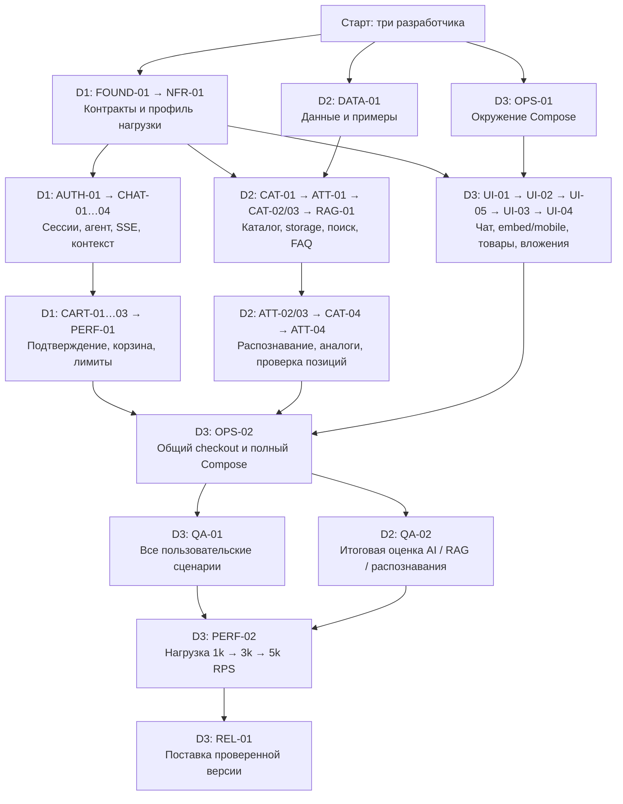
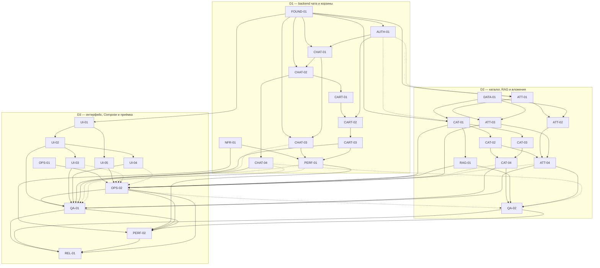

# Зависимости задач и порядок работы трёх разработчиков

Все 32 карточки пока имеют статус `todo`. Схема показывает план выполнения, а не уже готовые функции. [Общий план и правила](README.md) · [Единое ТЗ](../docs/ekt-assistant-spec.md).

**Начинаем одновременно:** D1 берёт FOUND-01, D2 — DATA-01, D3 — OPS-01. После раннего merge FOUND-01 все три потока могут реализовывать свои модули. У каждого разработчика одна основная задача за раз; очереди ниже выполняются параллельно между людьми.

## 1. Общая схема

Это укрупнённый порядок работы и объединения результатов. Узлы объединяют несколько карточек; точные зависимости отдельных задач приведены в разделе 5.



Связь от FOUND-01 открывает работу сразу после публикации контракта, без ожидания NFR-01. Подготовку OPS-02 и QA-02 можно начать раньше объединения всех модулей: на схеме показана их итоговая приёмка. D1 и D2 помогают D3 исправлять ошибки своих модулей во время интеграции и нагрузочных проверок.

## 2. Как читать точные зависимости

- `depends_on` / сплошная стрелка: какие результаты требуются для старта карточки. Сначала получить эти входы, затем брать задачу.
- `acceptance_depends_on` / пунктирная стрелка: что дополнительно должно быть интегрировано для итогового прогона и закрытия карточки. Ранняя реализация и подготовка тестов возможны раньше.
- Нумерация в очереди — рекомендуемый порядок работы одного человека. Это не дополнительные технические зависимости; независимые карточки можно переставить при сохранении всех условий.
- `wave` — ориентир, а не общий барьер. D3 не ждёт всего backend, чтобы сделать UI; D1 не ждёт всего каталога, чтобы написать агент на Java ports.
- Задача получает `done` после выполнения своих `Done when`, включая приёмочные зависимости. Частичный прогон или заглушки предметной логики не закрывают итоговый продукт.

## 3. Очередь каждого разработчика

В таблицах перечислены все прямые стартовые зависимости. Последовательность в каждом столбце команды не требует четвёртого разработчика.

### D1 — backend чата и корзины

Основные папки: `01-identity/`, `02-chat/`, `05-cart/`. Из общих папок: FOUND-01 и NFR-01 в `00-foundation/`, PERF-01 в `08-platform/`. Все пути здесь относительно `tasks/`.

| Шаг | Карточка | До старта получить |
|---|---|---|
| 1 | [FOUND-01 — Первый API-контракт, Java ports и схема handoff](00-foundation/FOUND-01-contracts-and-ports.md) | Можно сразу |
| 2 | [NFR-01 — Профиль 1k–5k RPS и измеримые условия релиза](00-foundation/NFR-01-workload-and-release-gates.md) | Можно сразу |
| 3 | [AUTH-01 — Visitor/partner identity и изоляция ресурсов](01-identity/AUTH-01-session-and-ownership.md) | [FOUND-01](00-foundation/FOUND-01-contracts-and-ports.md) |
| 4 | [CHAT-01 — Разговоры, история, durable runs и идемпотентность](02-chat/CHAT-01-history-and-runs.md) | [FOUND-01](00-foundation/FOUND-01-contracts-and-ports.md), [AUTH-01](01-identity/AUTH-01-session-and-ownership.md) |
| 5 | [CHAT-02 — OpenAI agent с ограниченным tool loop](02-chat/CHAT-02-agent-tools.md) | [FOUND-01](00-foundation/FOUND-01-contracts-and-ports.md), [CHAT-01](02-chat/CHAT-01-history-and-runs.md) |
| 6 | [CHAT-03 — SSE, reconnect и защита от устаревших событий](02-chat/CHAT-03-sse-recovery.md) | [FOUND-01](00-foundation/FOUND-01-contracts-and-ports.md), [CHAT-01](02-chat/CHAT-01-history-and-runs.md) |
| 7 | [CHAT-04 — Продолжение подбора и привязка пользовательского выбора](02-chat/CHAT-04-dialogue-context.md) | [CHAT-02](02-chat/CHAT-02-agent-tools.md) |
| 8 | [CART-01 — Предложения корзины без изменения корзины](05-cart/CART-01-immutable-proposals.md) | [CHAT-02](02-chat/CHAT-02-agent-tools.md) |
| 9 | [CART-02 — Отдельный Confirm Gate и проверка явного согласия](05-cart/CART-02-confirmation-gate.md) | [CART-01](05-cart/CART-01-immutable-proposals.md), [AUTH-01](01-identity/AUTH-01-session-and-ownership.md) |
| 10 | [CART-03 — Stateful Cart API, атомарность и неизвестный исход](05-cart/CART-03-cart-adapters-and-reconciliation.md) | [CART-02](05-cart/CART-02-confirmation-gate.md) |
| 11 | [PERF-01 — Общие лимиты, replay нескольких реплик и метрики](08-platform/PERF-01-limits-events-and-metrics.md) | [NFR-01](00-foundation/NFR-01-workload-and-release-gates.md), [CHAT-03](02-chat/CHAT-03-sse-recovery.md), [CART-03](05-cart/CART-03-cart-adapters-and-reconciliation.md) |

Первым публикует FOUND-01: OpenAPI snapshot, DTO/ports, ошибки и SSE events. После подключения D2 ports проверяет настоящие tool results и корзину. Миграции и shared backend-файлы объединяет по реестру из README.

### D2 — каталог, RAG и вложения

Основные папки: `03-catalog/`, `04-knowledge/`, `06-attachments/`. Из общих папок: DATA-01 в `00-foundation/`, QA-02 в `09-quality/`. Все пути здесь относительно `tasks/`.

| Шаг | Карточка | До старта получить |
|---|---|---|
| 1 | [DATA-01 — Синтетические данные и ожидаемые сценарии](00-foundation/DATA-01-sample-data-contract.md) | Можно сразу |
| 2 | [CAT-01 — Развитие каталога V2, безопасный импорт и индексация](03-catalog/CAT-01-import-and-schema.md) | [FOUND-01](00-foundation/FOUND-01-contracts-and-ports.md), [DATA-01](00-foundation/DATA-01-sample-data-contract.md) |
| 3 | [ATT-01 — Приватные вложения, storage и durable processing](06-attachments/ATT-01-upload-and-jobs.md) | [FOUND-01](00-foundation/FOUND-01-contracts-and-ports.md) |
| 4 | [CAT-02 — Точный, лексический и семантический поиск](03-catalog/CAT-02-search-and-comparison.md) | [CAT-01](03-catalog/CAT-01-import-and-schema.md) |
| 5 | [CAT-03 — Актуальные цены, остатки и склады](03-catalog/CAT-03-offers-and-stock.md) | [CAT-01](03-catalog/CAT-01-import-and-schema.md) |
| 6 | [RAG-01 — Условия покупки, versioned RAG и источники](04-knowledge/RAG-01-terms-and-sources.md) | [CAT-01](03-catalog/CAT-01-import-and-schema.md) |
| 7 | [ATT-02 — Excel и Word: строки, количества и координаты](06-attachments/ATT-02-office-extraction.md) | [ATT-01](06-attachments/ATT-01-upload-and-jobs.md), [DATA-01](00-foundation/DATA-01-sample-data-contract.md) |
| 8 | [ATT-03 — PDF, OCR и распознавание товара на JPEG](06-attachments/ATT-03-pdf-ocr-and-photo.md) | [ATT-01](06-attachments/ATT-01-upload-and-jobs.md), [DATA-01](00-foundation/DATA-01-sample-data-contract.md) |
| 9 | [CAT-04 — Совместимые аналоги и варианты частичной поставки](03-catalog/CAT-04-analogs-and-fulfillment.md) | [CAT-02](03-catalog/CAT-02-search-and-comparison.md), [CAT-03](03-catalog/CAT-03-offers-and-stock.md) |
| 10 | [ATT-04 — Сопоставление каталогу и ручная проверка строк](06-attachments/ATT-04-matching-and-review.md) | [CAT-02](03-catalog/CAT-02-search-and-comparison.md), [ATT-02](06-attachments/ATT-02-office-extraction.md), [ATT-03](06-attachments/ATT-03-pdf-ocr-and-photo.md) |
| 11 | [QA-02 — Качество поиска, аналогов, RAG и распознавания](09-quality/QA-02-rag-and-recognition-evaluation.md) | [CAT-04](03-catalog/CAT-04-analogs-and-fulfillment.md), [RAG-01](04-knowledge/RAG-01-terms-and-sources.md), [ATT-04](06-attachments/ATT-04-matching-and-review.md) |

После ATT-03 передаёт D3 готовые runtime-зависимости для упаковки OCR/parsers. CAT-04 и ATT-04 заканчивает, пока D3 готовит OPS-02. QA-02 начинает с корпуса и отдельных метрик; итоговые ответы/контекст проверяет после подключения CHAT-04 и runner OPS-02.

### D3 — интерфейс, Compose и приёмка

Основная папка: `07-widget/`. Из общих папок: OPS-01, OPS-02, PERF-02 в `08-platform/`; QA-01 и REL-01 в `09-quality/`. Все пути здесь относительно `tasks/`.

| Шаг | Карточка | До старта получить |
|---|---|---|
| 1 | [OPS-01 — Изолированный Compose и основа режимов запуска](08-platform/OPS-01-compose-foundation.md) | Можно сразу |
| 2 | [UI-01 — Generated клиент, auth и HTTP/SSE fixtures](07-widget/UI-01-client-and-fixtures.md) | [FOUND-01](00-foundation/FOUND-01-contracts-and-ports.md) |
| 3 | [UI-02 — Чат, история, streaming и восстановление](07-widget/UI-02-chat-and-streaming.md) | [UI-01](07-widget/UI-01-client-and-fixtures.md) |
| 4 | [UI-05 — Встраивание script/iframe и мобильный виджет](07-widget/UI-05-embed-and-mobile.md) | [UI-01](07-widget/UI-01-client-and-fixtures.md) |
| 5 | [UI-03 — Товары, аналоги, подтверждение и актуальная корзина](07-widget/UI-03-products-proposals-and-cart.md) | [UI-02](07-widget/UI-02-chat-and-streaming.md) |
| 6 | [UI-04 — Загрузка файлов и проверка распознанных позиций](07-widget/UI-04-attachments-review.md) | [UI-02](07-widget/UI-02-chat-and-streaming.md) |
| 7 | [OPS-02 — Полный Compose-продукт, seed и containerized test runner](08-platform/OPS-02-complete-product-compose.md) | [OPS-01](08-platform/OPS-01-compose-foundation.md), [UI-05](07-widget/UI-05-embed-and-mobile.md), [CAT-01](03-catalog/CAT-01-import-and-schema.md), [RAG-01](04-knowledge/RAG-01-terms-and-sources.md), [ATT-03](06-attachments/ATT-03-pdf-ocr-and-photo.md) |
| 8 | [QA-01 — Приёмка AC-1…14 и AC-17 через настоящий виджет](09-quality/QA-01-end-to-end-acceptance.md) | [OPS-02](08-platform/OPS-02-complete-product-compose.md), [UI-02](07-widget/UI-02-chat-and-streaming.md), [UI-03](07-widget/UI-03-products-proposals-and-cart.md), [UI-04](07-widget/UI-04-attachments-review.md), [CHAT-04](02-chat/CHAT-04-dialogue-context.md), [CART-03](05-cart/CART-03-cart-adapters-and-reconciliation.md), [CAT-04](03-catalog/CAT-04-analogs-and-fulfillment.md), [ATT-04](06-attachments/ATT-04-matching-and-review.md) |
| 9 | [PERF-02 — Нагрузка 1k→3k→5k, soak и отказоустойчивость](08-platform/PERF-02-load-and-failure-tests.md) | [NFR-01](00-foundation/NFR-01-workload-and-release-gates.md), [PERF-01](08-platform/PERF-01-limits-events-and-metrics.md), [OPS-02](08-platform/OPS-02-complete-product-compose.md), [QA-01](09-quality/QA-01-end-to-end-acceptance.md), [QA-02](09-quality/QA-02-rag-and-recognition-evaluation.md) |
| 10 | [REL-01 — Финальная интеграция, документация и поставка](09-quality/REL-01-release-handoff.md) | [QA-01](09-quality/QA-01-end-to-end-acceptance.md), [QA-02](09-quality/QA-02-rag-and-recognition-evaluation.md), [PERF-02](08-platform/PERF-02-load-and-failure-tests.md), [OPS-02](08-platform/OPS-02-complete-product-compose.md) |

После FOUND-01 генерирует SDK и работает на типизированных fixtures. OPS-02 начинает после своих UI-задач и готовности CAT-01/RAG-01/ATT-03. При ожидании коллег готовит runner, selectors и тесты; итоговый прогон выполняет после объединения модулей. Полную приёмку не проводит с browser mock backend.

## 4. Точки передачи между разработчиками

| Момент | Что должно быть готово | Что открывается |
|---|---|---|
| Ранний merge FOUND-01 | D1 отдаёт OpenAPI/Java ports; D2 сверяет поля, D3 генерирует SDK | Backend, data-модули и UI разрабатываются параллельно |
| Подключение identity | AUTH-01 проверяет реальную identity; CAT-01 и ATT-01 используют её в HTTP-пути | Можно принять доступ к импорту и приватность вложений |
| Подготовка OPS-02 | OPS-01, UI-05, CAT-01, RAG-01, ATT-03 | D3 упаковывает seed/index, storage/OCR и runner |
| Закрытие OPS-02 | Дополнительно PERF-01, CHAT-04, CAT-04, ATT-04, UI-03, UI-04 со всеми их зависимостями | Одна версия продукта в Compose, готовая к общей приёмке |
| Итоговые QA-01 и QA-02 | Общий checkout; реальные backend/data/UI; для QA-01 recovery/лимиты, для QA-02 agent pipeline и real AI evidence | Функциональная приёмка и оценка качества могут идти параллельно у D3/D2 |
| Начало PERF-02 | NFR-01, PERF-01, OPS-02, QA-01, QA-02 | Проверка нагрузки на принятом продукте и измеренном traffic/tool mix |
| REL-01 | QA-01, QA-02, PERF-02, OPS-02; отчёты соответствуют поставляемой версии | Передача продукта, команд и результатов |

**Объединение кода происходит до итоговых тестов.** D1/D2/D3 фиксируют общий commit, schema baseline, конфигурацию и версии образов на OPS-02; отчёты ссылаются на эту версию. REL-01 передаёт уже проверенный checkout. Если после тестов меняется код или конфигурация, определить затронутые критерии и повторить соответствующие проверки.

Минимальный путь к проверяемому продукту: контракты → три потока реализации → OPS-02 → QA-01. Для выполнения полного ТЗ нужны также QA-02 → PERF-02 → REL-01. Нагрузка означает **1k–5k всех HTTP-запросов API**, включая историю и статусы; успешный Compose startup сам по себе её не подтверждает.

Будущая команда полного запуска:

```bash
docker compose --profile full up -d --build
```

Будущий общий тестовый runner из OPS-02:

```bash
./scripts/test-compose.sh
```

Runner пока не реализован. Обычный `docker compose up -d` по текущему контракту поднимает БД. Для разработки и проверок используются отдельные worktrees/Compose projects; общую demo-БД не сбрасывать. Новые env и API синхронизировать по AGENTS.md и README.

## 5. Полный граф всех 32 карточек

Сплошные связи точно соответствуют `depends_on`; пунктирные — `acceptance_depends_on`. Линии внутри групп не задают очередь одного человека: для этого используйте раздел 3.



При изменении связей обновлять frontmatter и текст соответствующих карточек, этот граф и очереди одним PR. Проверять отсутствие циклов с учётом обоих типов связей. Статусы исполнения хранятся в карточках.

